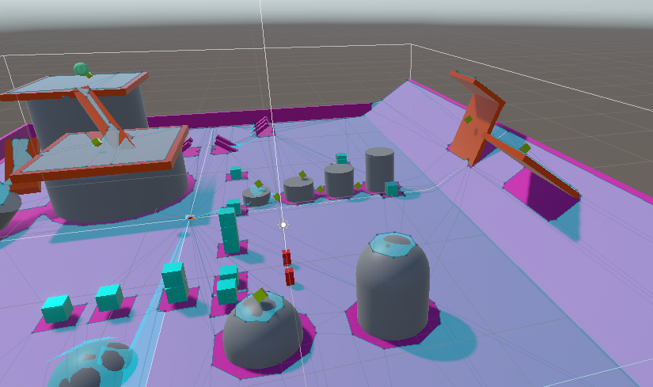
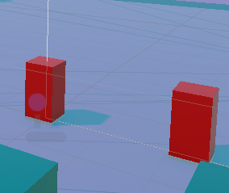

# Unity - Personalización del tablero

 Añadí diferentes obstáculos y elevaciones para ubicar los recolectables encima y aumentar la dificultad. Además, incorporé varias rutas de escape frente al objeto que nos persigue.

## Comportamiento del enemigo

Los dos enemigos cuando se acercan a 10 metros al player aumentan la velocidad, si el player se vuelve a alejar vuelve a recuperar la velocidad original.

Por muchas elevaciones que tiene el juego, está programado para que los dos enemigos puedan llegar hasta cualquier parte del mapa

